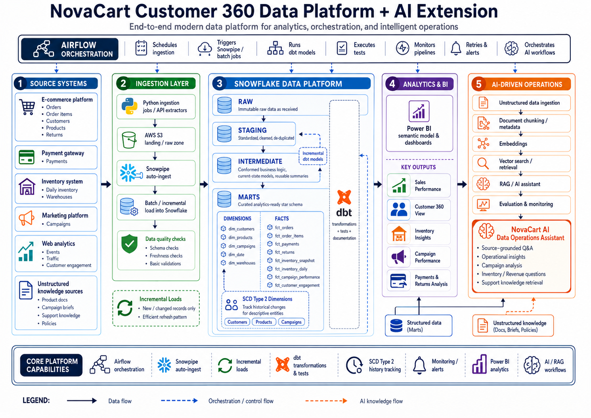

# NovaCart Customer 360 Data Platform

> A production-style end-to-end data engineering platform that unifies e-commerce, customer, payment, return, inventory, marketing, and web analytics data into a tested Snowflake dimensional warehouse, with planned production orchestration, incremental processing, historical modelling, BI, and AI-driven analytics.



---

## Project Overview

NovaCart is a modern **Customer 360 and analytics data platform** designed to simulate the type of architecture used in real-world data engineering environments.

The project consolidates data from multiple operational systems, processes it through layered Snowflake models, applies reusable business logic using dbt, and delivers analytics-ready dimensional marts.

The current warehouse foundation supports analysis across:

- Customers
- Orders
- Order items
- Products
- Payments
- Returns
- Inventory
- Warehouses
- Marketing campaigns
- Web engagement

The final architecture extends this foundation with:

- Snowpipe
- Incremental ingestion and transformation
- SCD Type 2
- Apache Airflow
- Power BI
- Vector search
- Retrieval-Augmented Generation
- AI evaluation
- NovaCart AI Data Operations Assistant

---

# Business Problem

Modern e-commerce organizations rarely store all operational data in one system.

Data is typically distributed across:

- E-commerce applications
- Customer / CRM systems
- Payment gateways
- Inventory platforms
- Marketing platforms
- Web analytics systems
- Internal documentation

This makes it difficult to answer cross-functional questions such as:

- Which customers generate the most revenue?
- Which products sell best?
- Which products are returned most frequently?
- Which payment methods fail most often?
- What are the most common payment failure reasons?
- Which warehouses are experiencing stockouts?
- How does inventory change over time?
- Which campaigns generate the highest ROAS?
- How does customer web engagement translate to sales?
- What is revenue after refunds?
- Which products need replenishment?
- What operational documentation supports an analytical answer?

NovaCart creates a unified analytical layer for answering these questions consistently.

---

# Architecture

The architecture below represents the **final target architecture** of the NovaCart platform.


The current milestone has completed the core **Snowflake + dbt analytical warehouse and dimensional modelling foundation**.

Production automation and AI capabilities are implemented in subsequent project phases.

---

# End-to-End Data Flow

```text
Operational Source Systems
          |
          v
Python Ingestion / AWS S3
          |
          v
Snowpipe / Batch Loading
          |
          v
Snowflake RAW
          |
          v
Snowflake STAGING
          |
          v
dbt INTERMEDIATE
          |
          v
dbt MARTS
          |
    -----------------
    |               |
    v               v
Power BI        AI / RAG Layer
```

---

# Source Systems

NovaCart integrates multiple business domains.

## E-commerce

- Orders
- Order items
- Customers
- Products
- Returns

## Payment Gateway

- Payment attempts
- Payment methods
- Payment status
- Captured amounts
- Failure reasons

## Inventory System

- Daily inventory
- Warehouses
- Opening stock
- Received quantities
- Sold quantities
- Damaged quantities
- Closing stock
- Inventory valuation

## Marketing Platform

- Campaigns
- Campaign budgets
- Campaign objectives
- Marketing channels

## Web Analytics

- Web events
- Customer activity
- Campaign engagement
- Product engagement
- Page visits
- Traffic sources

## Unstructured Knowledge Sources

The AI extension will also ingest:

- Product documentation
- Campaign briefs
- Business policies
- Support documentation
- FAQs
- Internal operational knowledge

---

# Technology Stack

## Data Engineering

- Python
- SQL
- AWS S3
- Snowflake
- Snowpipe
- dbt
- dbt-utils

## Orchestration

- Apache Airflow

## Data Modelling

- Dimensional modelling
- Star schema
- Surrogate keys
- Transaction fact tables
- Aggregate fact tables
- Periodic snapshot fact tables
- Slowly Changing Dimension Type 2

## Data Quality

- dbt tests
- Custom SQL tests
- Referential-integrity checks
- Business-rule validation
- Grain validation
- Freshness validation

## Analytics

- Power BI

## AI Data Engineering

- Document ingestion
- Chunking
- Metadata enrichment
- Embeddings
- Vector search
- Retrieval-Augmented Generation
- AI evaluation
- Source-grounded answers

## Engineering Practices

- Git
- GitHub
- Environment-variable secrets
- Reusable transformation layers
- Documentation
- Modular SQL
- Cost-conscious development

---

# Snowflake Data Architecture

NovaCart uses a layered warehouse architecture.

```text
RAW
 |
 v
STAGING
 |
 v
INTERMEDIATE
 |
 v
MARTS
```

---

## RAW Layer

The RAW layer stores source data as close as possible to the original records.

Its purpose is to provide:

- Traceability
- Reprocessing capability
- Source preservation
- Auditability
- Recovery from downstream transformation errors

Raw data remains minimally transformed.

---

## STAGING Layer

The staging layer standardizes each source system.

Typical staging transformations include:

- Data-type casting
- Column renaming
- Timestamp standardization
- Metadata preservation
- Basic cleaning
- Source normalization
- Deduplication preparation

Examples include models for:

- Orders
- Order items
- Products
- Customers
- Returns
- Payments
- Inventory
- Marketing campaigns
- Web events

---

## INTERMEDIATE Layer

The intermediate layer contains reusable business logic.

This prevents complex transformations from being repeatedly implemented inside final marts.

Examples include:

- Current customer records
- Current products
- Current orders
- Current payments
- Current returns
- Order payment summaries
- Order return summaries
- Order-item return summaries
- Product inventory summaries
- Marketing engagement summaries
- Campaign performance
- Customer engagement summaries

The intermediate layer helps separate:

```text
Source cleanup
        |
        v
Business logic
        |
        v
Analytics presentation
```

---

# Dimensional Modelling

The MARTS layer follows dimensional-modelling principles.

The modelling process used throughout NovaCart is:

```text
Business Process
       |
       v
Define Grain
       |
       v
Identify Dimensions
       |
       v
Identify Measures
       |
       v
Validate Join Safety
       |
       v
Test Business Rules
```

The most important modelling principle in the project is:

> The grain defines what one row represents.

---

# Dimensions

## `dim_customers`

**Grain:** One row per current customer.

Contains descriptive customer information such as:

- Customer ID
- Customer name
- Email
- Loyalty status
- Acquisition channel
- Registration information
- Active / inactive status

Purpose:

> Describe who the customer is.

---

## `dim_products`

**Grain:** One row per current product.

Contains:

- Product ID
- SKU
- Product name
- Category
- Subcategory
- Brand
- Unit cost
- List price
- Unit margin

Purpose:

> Describe what the product is.

---

## `dim_campaigns`

**Grain:** One row per marketing campaign.

Contains:

- Campaign ID
- Campaign name
- Campaign channel
- Campaign objective
- Campaign status
- Target segment
- Campaign start date
- Campaign end date

Purpose:

> Describe the marketing campaign.

---

## `dim_date`

**Grain:** One row per calendar date.

Contains:

- Date
- Day
- Week
- Month
- Quarter
- Year
- Weekend indicator
- Month-start and month-end dates

Purpose:

> Provide consistent calendar analysis across fact tables.

This dimension also contains days when no business transactions occurred.

---

## `dim_warehouses`

**Grain:** One row per warehouse.

Contains:

- Warehouse ID
- Warehouse name
- Warehouse city
- Warehouse country

Purpose:

> Describe where inventory is stored.

---

# Fact Tables

## `fct_orders`

**Business process:** Customer orders

**Grain:**

```text
1 row = 1 order
```

Contains measures such as:

- Item count
- Total quantity
- Subtotal
- Discount
- Shipping amount
- Order total
- Payment attempt count
- Captured amount
- Outstanding balance
- Refund amount
- Net captured revenue after refunds

Connects primarily to:

- `dim_customers`
- `dim_date`

Example questions:

- How many orders were placed?
- What is revenue by customer?
- What is revenue by sales channel?
- How much revenue remains after refunds?
- How many orders required multiple payment attempts?

---

## `fct_order_items`

**Business process:** Products sold within orders

**Grain:**

```text
1 row = 1 product line inside 1 order
```

Contains:

- Order item ID
- Order ID
- Product key
- Customer key
- Quantity
- Unit price
- Gross amount
- Discount rate
- Discount amount
- Net amount

Connects to:

- `dim_products`
- `dim_customers`

Example questions:

- Which products generate the most revenue?
- What is revenue by product category?
- Which products receive the highest discounts?
- Which brands are purchased by different customer segments?

---

## `fct_payments`

**Business process:** Payment processing

**Grain:**

```text
1 row = 1 payment attempt
```

Contains:

- Payment ID
- Order ID
- Customer key
- Payment attempt number
- Payment method
- Payment status
- Payment amount
- Captured amount
- Currency
- Failure reason
- Payment timestamp

Supports questions such as:

- Which payment methods fail most often?
- What percentage of payments are successful?
- How many attempts occur before successful payment?
- What are the most common gateway failure reasons?
- How much money was successfully captured?

---

## `fct_returns`

**Business process:** Product returns

**Grain:**

```text
1 row = 1 return transaction
```

Contains:

- Return ID
- Order ID
- Order item ID
- Customer key
- Product key
- Return date
- Return quantity
- Return reason
- Return status
- Refund amount

Supports:

- Return-rate analysis
- Return reason analysis
- Refund analysis
- Product return analysis
- Customer return behaviour

---

## `fct_inventory_snapshot`

**Business process:** Current inventory position

**Grain:**

```text
1 row = latest inventory position for 1 product
```

Contains:

- Opening stock
- Received quantity
- Sold quantity
- Damaged quantity
- Closing stock
- Inventory value
- Weighted average unit cost
- Stockout warehouse count
- Reorder warehouse count
- Stockout indicator
- Reorder indicator

Useful for:

- Current inventory value
- Current product availability
- Reorder monitoring
- Stockout detection

---

## `fct_inventory_daily`

**Business process:** Historical inventory

**Grain:**

```text
1 row =
1 product
× 1 warehouse
× 1 inventory date
```

This composite grain allows warehouse-level historical analysis.

Contains:

- Opening stock
- Received quantity
- Sold quantity
- Damaged quantity
- Closing stock
- Unit cost
- Inventory value
- Stockout flag
- Reorder flag

Connects to:

- `dim_products`
- `dim_warehouses`
- `dim_date`

Supports:

- Inventory trends
- Warehouse comparison
- Historical stockout analysis
- Inventory valuation over time
- Replenishment analysis

---

## `fct_campaign_performance`

**Business process:** Marketing performance

**Grain:**

```text
1 row = 1 marketing campaign
```

Contains:

- Budget
- Web events
- Unique customers engaged
- Attributed orders
- Converted customers
- Captured payment orders
- Refunded orders
- Captured revenue
- Refund amount
- Net revenue
- Conversion rate
- Cost per attributed order
- Average order value
- ROAS
- Revenue refund rate

Connects to:

- `dim_campaigns`

Supports:

- Marketing ROI analysis
- Campaign conversion analysis
- Revenue attribution
- ROAS comparison
- Refund-adjusted campaign performance

---

## `fct_customer_engagement`

**Business process:** Customer digital engagement

**Grain:**

```text
1 row = engagement summary for 1 identifiable customer
```

Contains:

- Total web events
- Event-type count
- Campaigns engaged
- Attributed orders
- Products engaged
- Pages visited
- Device types
- Browsers
- Traffic sources
- First event
- Latest event

Connects to:

- `dim_customers`

Supports:

- Customer engagement analysis
- Customer 360 reporting
- Digital behaviour analysis
- Engagement-to-conversion analysis

---

# Star Schema Relationships

```text
                         dim_date
                            |
                            |
                        fct_orders
                            |
                            |
                     dim_customers
                    /      |       \
                   /       |        \
                  /        |         \
       fct_payments   fct_order_items   fct_customer_engagement
                         |
                         |
                    dim_products
                     /       \
                    /         \
          fct_returns       fct_inventory_daily
                                   |
                                   |
                             dim_warehouses


dim_products
     |
     |
fct_inventory_snapshot


dim_campaigns
     |
     |
fct_campaign_performance
```

Fact tables are intentionally kept at different grains instead of being merged into one large table.

For example:

```text
fct_orders
1 row = 1 order

fct_order_items
1 row = 1 order line

fct_payments
1 row = 1 payment attempt

fct_returns
1 row = 1 return transaction
```

This avoids incorrect aggregations and supports each business process independently.

---

# Data Quality Strategy

Data quality is implemented throughout the project using dbt generic tests and custom business-rule tests.

---

## Grain Tests

Examples:

```text
fct_orders
order_id must be unique
```

```text
fct_order_items
order_item_id must be unique
```

```text
fct_payments
payment_id must be unique
```

```text
fct_returns
return_id must be unique
```

For historical inventory, individual identifiers are not unique.

Instead:

```text
inventory_date
+ warehouse_id
+ product_id
```

must be unique together.

This validates the composite grain.

---

# Referential Integrity Tests

Fact tables validate their relationships with dimensions.

Examples include:

```text
fct_order_items.product_key
        ->
dim_products.product_key
```

```text
fct_orders.customer_key
        ->
dim_customers.customer_key
```

```text
fct_inventory_daily.warehouse_key
        ->
dim_warehouses.warehouse_key
```

```text
fct_campaign_performance.campaign_key
        ->
dim_campaigns.campaign_key
```

---

# Business-Rule Testing

NovaCart includes tests that validate business meaning rather than only checking null values.

---

## Order Item Reconciliation

```text
gross_amount
=
quantity × unit_price
```

```text
net_amount
=
gross_amount - discount_amount
```

---

## Revenue Reconciliation

```text
net_revenue_after_refunds
=
captured_revenue - completed_refunds
```

---

## Inventory Reconciliation

```text
closing_stock
=
opening_stock
+ received_quantity
- sold_quantity
- damaged_quantity
```

---

## Inventory Valuation

```text
inventory_value
=
closing_stock × unit_cost
```

---

## Payment Business Rules

PAID:

```text
captured_amount > 0
failure_reason = NULL
```

FAILED:

```text
captured_amount = 0
failure_reason IS NOT NULL
```

PENDING / CANCELLED:

```text
captured_amount = 0
```

---

## Return Business Rules

COMPLETED:

```text
refund_amount > 0
```

PENDING:

```text
refund_amount = 0
```

REJECTED:

```text
refund_amount = 0
```

---

# Snowpipe

The final architecture uses **Snowpipe auto-ingestion** to automatically load new files arriving in the AWS S3 landing zone into Snowflake.

Target flow:

```text
Source
   |
   v
AWS S3
   |
   v
Snowpipe
   |
   v
Snowflake RAW
```

Benefits:

- Automated ingestion
- Reduced manual loading
- Near-real-time file ingestion
- Scalable ingestion pattern
- Better production reliability

---

# Incremental Processing

The production architecture will use incremental loading where appropriate.

Instead of rebuilding complete tables:

```text
All historical rows
        |
        v
Reprocess everything
```

the pipeline will process:

```text
New / changed rows only
        |
        v
Incremental transformation
```

Benefits include:

- Lower Snowflake compute usage
- Faster pipeline execution
- Better scalability
- Production-style processing

Candidate incremental models include transaction-heavy datasets such as:

- Orders
- Order items
- Payments
- Returns
- Inventory
- Web events

---

# Slowly Changing Dimension Type 2

SCD Type 2 will preserve historical dimension changes.

Example:

A customer changes from:

```text
LOYALTY_STATUS = SILVER
```

to:

```text
LOYALTY_STATUS = GOLD
```

Instead of overwriting the old record, SCD Type 2 preserves both versions.

Example:

```text
customer_id | loyalty_status | valid_from | valid_to   | is_current
C100        | SILVER         | 2025-01-01 | 2026-03-10 | FALSE
C100        | GOLD           | 2026-03-11 | NULL       | TRUE
```

This allows historical questions such as:

> What loyalty status did the customer have when the order was placed?

Potential SCD2 dimensions include:

- Customers
- Products
- Campaigns

---

# Airflow Orchestration

Apache Airflow forms the orchestration layer of the final platform.

Airflow will coordinate:

```text
Data ingestion
      |
      v
Snowflake loading
      |
      v
dbt transformations
      |
      v
dbt tests
      |
      v
Analytics refresh
      |
      v
AI workflows
```

Planned Airflow responsibilities include:

- Scheduled ingestion
- Dependency management
- dbt execution
- Data-quality gates
- Retries
- Failure handling
- Monitoring
- Alerts
- AI workflow orchestration

---

# Power BI Analytics

Power BI will consume the dimensional marts through a semantic model.

Planned dashboard areas include:

## Executive Overview

- Revenue
- Orders
- Customers
- Average order value
- Refunds
- Net revenue

## Customer 360

- Customer segmentation
- Loyalty analysis
- Acquisition channel
- Customer engagement
- Customer revenue
- Return behaviour

## Product Performance

- Product sales
- Category performance
- Discounts
- Returns
- Revenue

## Inventory

- Current stock
- Historical stock
- Warehouse inventory
- Stockouts
- Reorder requirements
- Inventory value

## Marketing

- Campaign revenue
- Conversion
- ROAS
- Cost per attributed order
- Refund-adjusted revenue

## Payments & Returns

- Payment success
- Failure reasons
- Payment methods
- Return reasons
- Refund values

---

# AI-Driven Analytics Extension

NovaCart extends beyond traditional BI into AI-assisted analytics.

The architecture combines:

```text
Structured Snowflake Marts
             |
             |
             +----------+
                        |
                        v
                 Retrieval Layer
                        ^
                        |
             +----------+
             |
Unstructured Business Documents
```

---

## Unstructured Data Pipeline

Documents will be processed through:

```text
Documents
   |
   v
Parsing
   |
   v
Chunking
   |
   v
Metadata
   |
   v
Embeddings
   |
   v
Vector Search
   |
   v
RAG
```

---

# NovaCart AI Data Operations Assistant

The final platform includes an AI-powered operational analytics assistant.

The assistant will combine structured warehouse data with unstructured knowledge.

Example questions:

- Which products currently need reordering?
- Which warehouses experience repeated stockouts?
- Why did revenue decline during a specific period?
- Which campaigns produced the strongest ROAS?
- Which payment failures occur most often?
- Which products have the highest return rates?
- Which customer groups generate the highest revenue?
- What business policy explains a particular process?
- What documentation supports this answer?

The objective is to deliver:

- Source-grounded answers
- Data-backed operational insights
- Document-grounded explanations
- Reduced hallucination
- Traceable information

---

# AI Evaluation

The AI layer will include evaluation and monitoring.

Evaluation areas include:

- Retrieval accuracy
- Source relevance
- Groundedness
- Answer correctness
- Citation quality
- Latency
- Failure analysis

This ensures that the AI assistant is evaluated as a data product rather than only demonstrated as a chatbot.

---

# Security & Secrets

Sensitive credentials are excluded from version control.

Examples include:

```text
.env
profiles.yml
API keys
AWS credentials
Snowflake passwords
```

Environment-specific configuration remains local.

GitHub stores only safe project configuration and source code.

---

# Repository Structure

```text
novacart-customer-360-data-platform/
│
├── assets/
│   └── novacart-final-architecture.png
│
├── dbt_novacart/
│   │
│   ├── models/
│   │   │
│   │   ├── staging/
│   │   │   ├── crm/
│   │   │   ├── ecommerce/
│   │   │   ├── payment_gateway/
│   │   │   ├── inventory_system/
│   │   │   ├── marketing_platform/
│   │   │   └── web_analytics/
│   │   │
│   │   ├── intermediate/
│   │   │   ├── crm/
│   │   │   ├── ecommerce/
│   │   │   ├── payment_gateway/
│   │   │   ├── inventory_system/
│   │   │   ├── marketing_platform/
│   │   │   └── web_analytics/
│   │   │
│   │   └── marts/
│   │       └── core/
│   │
│   ├── tests/
│   ├── dbt_project.yml
│   ├── packages.yml
│   └── package-lock.yml
│
├── airflow/
├── scripts/
├── data/
├── .gitignore
└── README.md
```

---

# Current Implementation Status

| Capability | Status |
|---|---|
| Multi-source data modelling | ✅ Completed |
| AWS S3 ingestion foundation | ✅ Completed |
| Python ingestion foundation | ✅ Completed |
| Snowflake RAW layer | ✅ Completed |
| Snowflake STAGING layer | ✅ Completed |
| Snowflake INTERMEDIATE layer | ✅ Completed |
| dbt transformations | ✅ Completed |
| dbt generic tests | ✅ Completed |
| Custom business-rule tests | ✅ Completed |
| Dimensional modelling | ✅ Completed |
| Customer dimension | ✅ Completed |
| Product dimension | ✅ Completed |
| Campaign dimension | ✅ Completed |
| Date dimension | ✅ Completed |
| Warehouse dimension | ✅ Completed |
| Order fact | ✅ Completed |
| Order-item fact | ✅ Completed |
| Payment fact | ✅ Completed |
| Return fact | ✅ Completed |
| Current inventory snapshot | ✅ Completed |
| Historical inventory fact | ✅ Completed |
| Campaign performance fact | ✅ Completed |
| Customer engagement fact | ✅ Completed |
| Snowpipe auto-ingestion | 🔄 Next implementation |
| Incremental dbt models | 🔄 Next implementation |
| SCD Type 2 | 🔄 Next implementation |
| Airflow orchestration | 🔄 Next implementation |
| Monitoring / alerting | 🔄 Next implementation |
| Power BI semantic model | 🔄 Next implementation |
| Power BI dashboards | 🔄 Next implementation |
| Document ingestion | 🔄 AI phase |
| Embeddings | 🔄 AI phase |
| Vector search | 🔄 AI phase |
| RAG assistant | 🔄 AI phase |
| AI evaluation | 🔄 AI phase |

---

# Next Engineering Milestones

## Phase 1 — Production Ingestion

- Implement Snowpipe
- Configure automated S3-to-Snowflake ingestion
- Add ingestion monitoring
- Add failure handling

## Phase 2 — Incremental Processing

- Convert suitable dbt models to incremental models
- Implement watermark / timestamp logic
- Validate idempotency
- Reduce unnecessary Snowflake compute

## Phase 3 — Historical Dimensions

- Implement SCD Type 2
- Preserve customer history
- Preserve product history
- Preserve campaign history

## Phase 4 — Airflow

- Create DAGs
- Schedule ingestion
- Run dbt transformations
- Run dbt tests
- Add retries
- Add monitoring
- Add alerts

## Phase 5 — Power BI

- Build semantic model
- Configure star-schema relationships
- Create DAX measures
- Build dashboards
- Develop business insights

## Phase 6 — AI Data Engineering

- Ingest unstructured documents
- Extract text and metadata
- Chunk documents
- Generate embeddings
- Build vector retrieval
- Implement RAG
- Connect structured Snowflake analytics
- Build NovaCart AI Data Operations Assistant
- Evaluate retrieval and answers

---

# Key Engineering Lessons

This project focuses on more than writing SQL.

Major concepts demonstrated include:

- Choosing the correct grain before modelling
- Distinguishing facts from dimensions
- Avoiding fact-to-fact joins with incompatible grains
- Preserving business-process detail
- Designing transaction facts
- Designing snapshot facts
- Designing aggregate facts
- Using surrogate keys
- Validating referential integrity
- Implementing business-rule tests
- Modelling historical inventory
- Separating operational logic from analytics presentation
- Building reusable intermediate models
- Thinking about compute cost
- Preparing pipelines for incremental execution
- Designing for orchestration
- Designing structured data for AI consumption

---

# Example Business Questions Supported

## Sales

- What is total revenue?
- What is net revenue after refunds?
- Which channels generate the most revenue?
- Which customers spend the most?

## Products

- Which products sell the most?
- Which categories generate the most revenue?
- Which products receive the highest discounts?

## Customers

- Which loyalty groups generate the most revenue?
- Which acquisition channels produce valuable customers?
- How does customer engagement relate to orders?

## Payments

- Which payment methods have the highest failure rates?
- What failure reasons occur most frequently?
- How many attempts are required before successful payment?

## Returns

- Which products are returned most often?
- What are the most common return reasons?
- How much money is refunded?

## Inventory

- Which products are out of stock?
- Which products need reorder?
- How has inventory changed over time?
- Which warehouses have the highest inventory value?

## Marketing

- Which campaigns generate the highest ROAS?
- Which campaigns generate the most attributed revenue?
- What is the customer conversion rate?
- How much campaign revenue is lost through refunds?

---

# Project Goal

NovaCart is designed as a production-style portfolio project demonstrating the skills expected from modern data engineers and analytics engineers.

The project demonstrates practical experience with:

```text
Python
SQL
AWS S3
Snowflake
Snowpipe
dbt
Dimensional Modelling
Data Quality
Incremental Processing
SCD Type 2
Apache Airflow
Power BI
Vector Search
RAG
AI Data Engineering
Git
GitHub
```

The long-term goal is to demonstrate the ability to design, build, test, automate, monitor, and explain an end-to-end cloud data platform rather than only create isolated SQL transformations.

---

# Current Milestone

The current milestone completes the primary analytical warehouse foundation:

```text
Multi-source data
       |
       v
Snowflake
       |
       v
dbt business logic
       |
       v
Tested dimensional marts
```

The next milestone evolves the platform into a production-style automated architecture:

```text
Snowpipe
   |
   v
Incremental Processing
   |
   v
SCD Type 2
   |
   v
Airflow
   |
   v
Power BI
   |
   v
AI / RAG
```

---

## Author

Built as a hands-on data engineering portfolio project focused on production thinking, dimensional modelling, data quality, analytics engineering, orchestration, and AI-enabled data platforms.